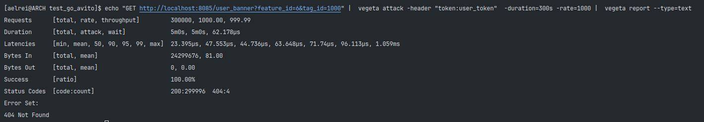
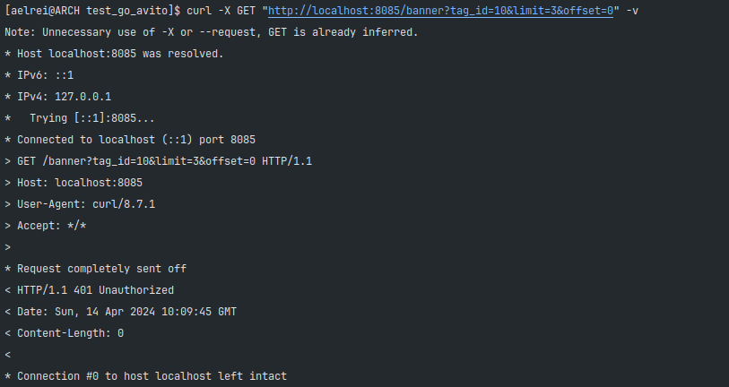

# Тестовое задание для стажёра Backend

- [Задание](./Task.md)

## Комментарии к тестовому заданию

#### Краткое юмористическое вступление.
> У нас было меньше двух недель на тестовое, огромное желание его сделать, пара-тройка часов в день, чтобы оно работало,
минимальная подготовка в Golang, немного лучше в Postgresql и целая кипа всевозможных материалов различных авторов книг и статей,
Куча функций, пакетов и циклов в проекте. Не то, чтобы всё это было категорически необходимо, чтобы сделать проект качественно, 
но если уж начал делать тестовое, то к делу надо подходить серьёзно. (Отсылка на книгу "Страх и Ненависть в Лас-Вегасе")

А теперь к более серьёзным вещам. Сразу скажу, что понимаю, что код вообще неидеальный и в нем есть что исправлять и оптимизировать.
В силу малого опыта, я не уложусь в рамки времени тестового, если захочу качественно доработать сервис.
Конкретно, думаю, можно оптимизировать лучше кэш, сделать функции методами структур и обеспечить более быстрый доступ к бд
за счет смены библиотеки или оптимизации кода.

### Стек
- Golang 1.22.0
- Postgres 16.2
- Docker и docker-compose

#### Команды MakeFile:
- make docker_compose - команда, которая строит новый образ который разворачивает golang и postgres с установкой переменных окружений, 
проброской портов для дальнейшего тестирования на локальной машине по адресу http://localhost:8085. Потребуется некоторое время, 
чтобы заполнить данными таблицы в бд. Можно будет начать тестировать, когда придет сообщение "success upload cache".
- make docker_compose_up - команда, чтобы в случае ручной остановки сервиса не пришлось всё заново собирать.
- make test - тестирование сервиса на получение баннеров или их неполучения.
- make - make docker_compose(по умолчанию)

#### Итоги и вопросы, которые возникали:
1. Первый опыт использования технического API. Постарался всё соблюсти.
2. Тегов и фичей до 1000. Судя по тестам, сервис удовлетворяет требованиям, которые поставлены во 2 пункте условий.
```
echo "GET http://localhost:8085/user_banner?feature_id=2&tag_id=1" | 
vegeta attack -header "token:user_token"  -duration=60s -rate=1000 | 
vegeta report --type=text
```

```
echo "GET http://localhost:8085/user_banner?feature_id=2&tag_id=1&use_last_revision=true" | 
vegeta attack -header "token:user_token"  -duration=60s -rate=1000 | 
vegeta report --type=text
```

```
echo "GET http://localhost:8085/user_banner?feature_id=6&tag_id=1000" | 
vegeta attack -header "token:user_token"  -duration=60s -rate=1000 | 
vegeta report --type=text
```

```
echo "GET http://localhost:8085/user_banner?feature_id=6&tag_id=1000&use_last_revision=true" | 
vegeta attack -header "token:user_token"  -duration=60s -rate=1000 | 
vegeta report --type=text
```

```
echo "GET http://localhost:8085/user_banner?feature_id=6&tag_id=1000" |  
vegeta attack -header "token:user_token"  -duration=300s -rate=1000 |  
vegeta report --type=text
```

В последнем сценарии видно, чтоб несколько запросов выдают код 404. 
Это происходит, так как во время запроса может проиcходить перезаполнение кэша.
Однако, это всё ещё удовлетворяет условию успешности запроса в 99.99%(Кэш обновляется раз в 5 минут).
3. Токены реализованы в соответствии с условием.
4. Тест запускается командой "make test"
5. Кэш реализован с помощью gocache и время актуальности - 5 минут.
6. Функция отключения баннеров реализована через метод PATCH. 
После этого, они перестают быть видны пользователям с user_token, однако для admin_token они всё еще видны.

В итоге для проверки полноценной проверки мы пишем make, ждем пока соберется сервис. 
Дальше проверяем сценарий на получения баннера make test. 
После этого мы можем вручную взаимодействовать с помощью собственных запросов или представленных ниже.

## Методы, применяемые для ручной проверки
### GET /user_banner:
- ```shell
  curl -X GET "http://localhost:8085/user_banner?feature_id=2&tag_id=1&use_last_revision=true" -H "token:admin_token" -v
  ```

- ```shell
  curl -X GET "http://localhost:8085/user_banner?feature_id=2&tag_id=1" -H "token:user_token" -v
  ```

- ```shell
  curl -X GET "http://localhost:8085/user_banner?feature_id=6&tag_id=999" -H "token:user_token" -v
  ```

### GET /banner:
- ```shell
  curl -X GET "http://localhost:8085/banner?tag_id=10&limit=3&offset=0" -H "token:admin_token" -v
  ```
  
- ```shell
  curl -X GET "http://localhost:8085/banner?tag_id=10&limit=3&offset=0" -H "token:user_token" -v
  ```

- ```shell
  curl -X GET "http://localhost:8085/banner?tag_id=10&limit=3&offset=0" -v
  ```

### POST /banner:
- ```shell
  curl -X 'POST'   'http://localhost:8085/banner'   -H 'accept: application/json'   -H 'token: admin_token'   -H 'Content-Type: application/json'   -d '{
  "tag_ids": [
  1000
  ],
  "feature_id": 40,
  "content": {
  "title": "some_title",
  "text": "some_text",
  "url": "some_url"
  },
  "is_active": true
  }' -v
  ```
  
- при таком же повторном запросе будет ошибка о дубликатах.
  
- Некорректный запрос. 
```shell
curl -X 'POST'   'http://localhost:8085/banner'   -H 'accept: application/json'   -H 'token: admin_token'   -H 'Content-Type: application/json'   -d '{
  "tag_ids": [
  96  
  ],
  "feature_id": 49,
  "content": {
  "title": "some_title",
  "text": "some_text",
  },                 
  "is_active": true
  }' -v
  ```
  

### PATCH /banner/{id}:
```shell
curl -X 'PATCH'   'http://localhost:8085/banner/999'   -H 'accept: */*'   -H 'token: admin_token'   -H 'Content-Type: application/json'   -d '{ "tag_ids": [ 14 ],
  "feature_id": 14,
  "content": {
  "title": "some_title",
  "text": "some_text",
  "url": "some_url"
  },
  "is_active": false
  }' -v
```

```shell
curl -X 'PATCH'   'http://localhost:8085/banner/1500'   -H 'accept: */*'   -H 'token: admin_token'   -H 'Content-Type: application/json'   -d '{
  "tag_ids": [
    14
  ],
  "feature_id": 14,
  "content": {
    "title": "some_title",
    "text": "some_text",
    "url": "some_url"
  },
  "is_active": false
}' -v
```

```shell
curl -X GET "http://localhost:8085/user_banner?feature_id=14&tag_id=14&use_last_revision=true" -H "token:user_token" -v
```
Видно что, с флагом false пользователь с user_token не увидит баннер

### DELETE banner/{id}:
```shell
curl -X 'DELETE'   'http://localhost:8085/banner/2'   -H 'accept: */*'   -H 'token: admin_token' -v
```

- Если повторить, то, выдаст ошибку.
  
